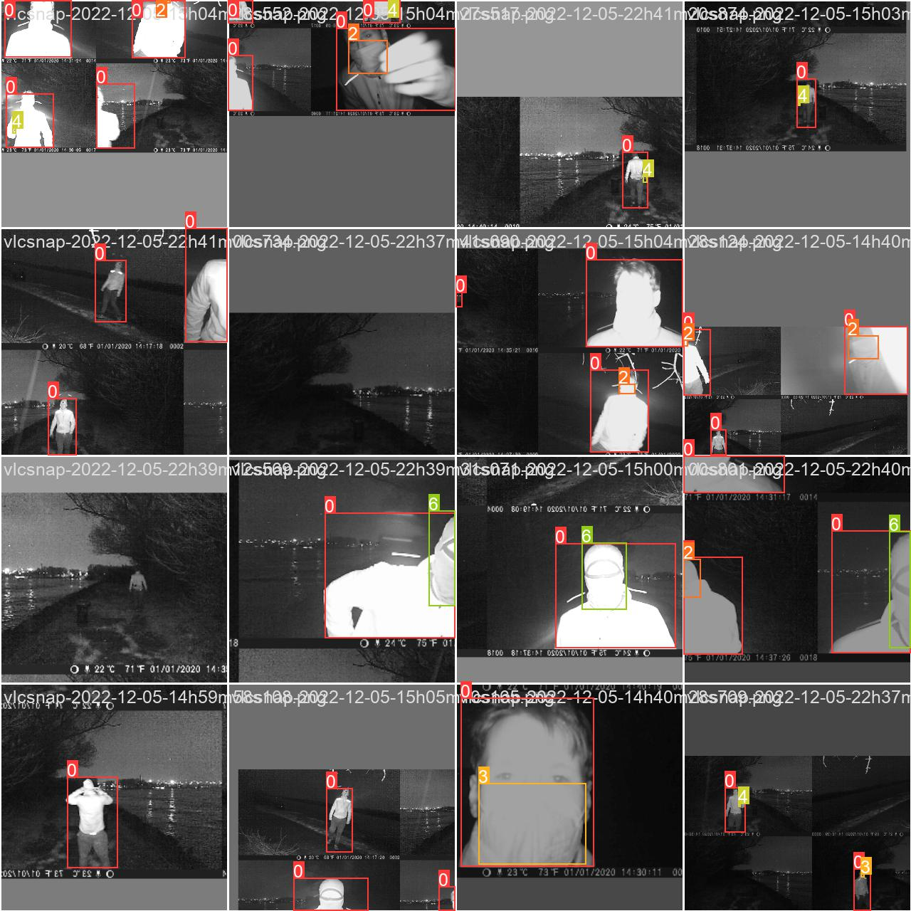
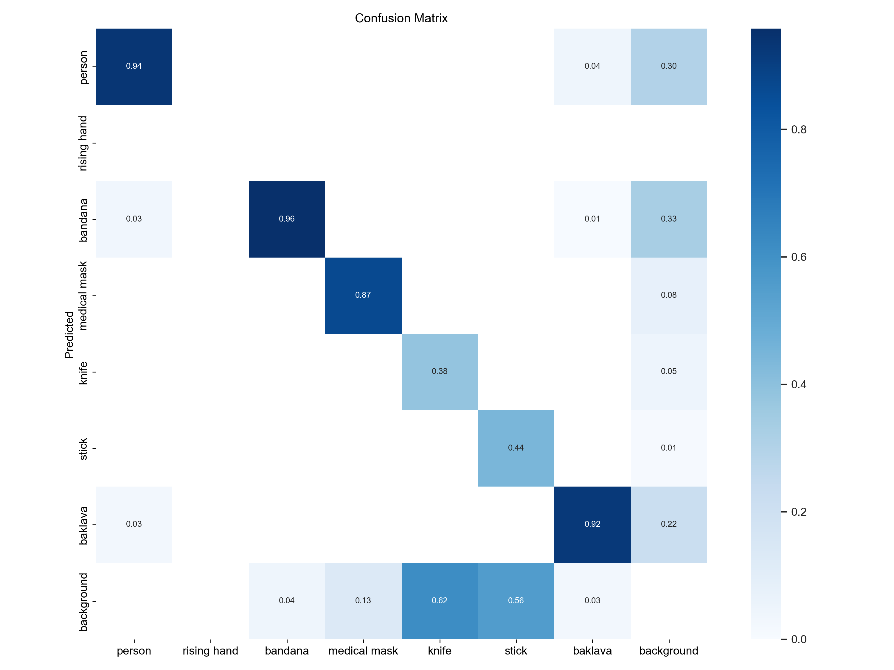

# Diplomová práca - Využitie infračerveného žiarenia a termovízie na ochranu verejných priestorov a budov

Cieľom tejto diplomovej práce je preskúmať možnosti využitia infračerveného žiarenia a termovízie pri ochrane priestorov 
s vyššim pohybom osôb prípadne vonkajších priestorov budov. V práci analyzujem prípady použitia IR spektra a temovízie pri monitorovaní priestorov kamerou. 

## Infračervené kamery

Hlavné využitie je v podmienkách s nedostatočným prirodzeným osvetlením. Obyčajné kamery zobrazujú rôzne farby ktoré sú odrážané z objektov po dopade lúčov bieleho svetla. Toto nie je ale možné v noci, kedy ako jediný prirodzený svetelný zdroj je mesačné svetlo alebo umelé osvetlenie pomocou svietidiel. Infračervené svetlo je elektromagnetické žiarenie ktoré vyžaruje každý dosiaľ známy predmet, organizmus alebo vesmírny objekt.

MRozdiel medzi termovíziou a nočným videním je že nočné videnie využíva krátke vlny IR žiarenia na osvetlenie prostredia. Termovízia využíva stredné a dlhé vlny IR a dokážu iba identifikovať teplotu, najčastejšie ako biela - teplo a čierna - zima. Výhoda oproti kátkym vlnám IR je tá že záznam nie je rušený odrazovaným svetlom.

# Postup 

Plán implementácie:

- Zachytávanie videozáznamu pomocou OpenCV
- Získať snímky z videozáznamu
- Detekcia človeka
- Detekcia masky, šatky a noža na človeku
- Vyhodnotenie úrovne nebezpečenstva na základe zistení
- Vyskúšat techniky preporcessingu na zlepsenie výsledkov
- Porovnanie Accuracy, Precision

Pre jednotlivé kroky preskúmam existujúce riešenia a navrhnem také, ktoré sa bude najviac hodiť mojím potrebám. V sekcií "Članky" stručne popisujem techniky riešenia krokov z môjho plánu implementácie.

Naštudované članky:

[Seminárna práca 1](./seminarna_praca_1.md)

[Seminárna práca 2](./seminarna_praca_2.md)

[Prezentácia 2](./prezentacia_2.pdf)

[Návod na spustenie](./src/README.md)

Progres:

* Preskúmanie a popísanie elektromagnetického spektra
* Hľadanie využitia Ultrafialoveho a jendotlivých pásiem infračerveného žiarenia
* Vyskúšanie YOLO siete na detekciu ľudí
* Návrh aplikácie
* Výber kamery
* Natočenie videzáznamov v rôznych scénach a podmienkach
* Označenie jednotlivých snímkov extrahovaných z videí
* Trénovanie siete YOLO pomocou transfer learningu
* Pridanie obrázkov z datasetu nožov pod vidtelnym svetlom a po zhorseni výsledkov ich odobranie
* Hľadanie spôsobu ako vygenerovať dataset z obrazkov zachytenych pod viditelnym svetlom na tie s nocnym videnim
* Pridanie detekcie kolízie človeka a objektov maska, šatka nôž

[Demonštrácia detekcie - video](https://drive.google.com/file/d/1qd7Ynd5t22ddHLqbUZsv77QKZT0pcXTm/view?usp=sharing)

